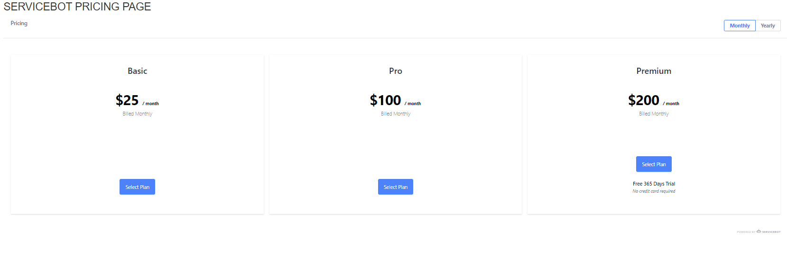
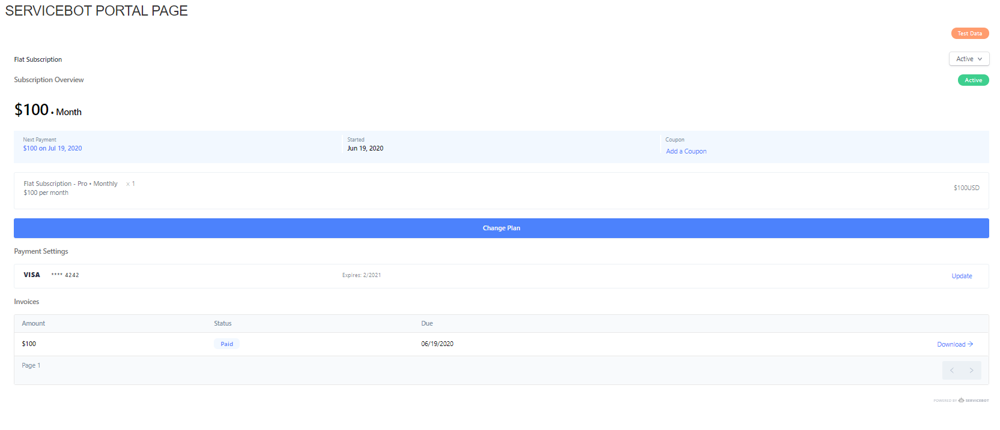

# shinyservicebot

[](https://cran.r-project.org/package=shinyservicebot)

`shinyservicebot` is a Shiny integration for servicebot billing.

Servicebot provides a user interface (UI) on top of Stripe. Stripe will remain the single source of truth for all things billing which makes Servicebot the easiest & fastest way to launch with Stripe.

[Click here](https://docs.servicebot.io/) for more information about 
servicebot

## Installation

To install the stable version from CRAN, simply run the following from an R console:

```r
install.packages("shinyservicebot")
```

To install the latest development builds directly from GitHub, run this instead:

```r
if (!require("remotes")) install.packages("remotes")
remotes::install_github("capiaas/shinyservicebot")
```


## Getting Started

To learn more we highly recommend you check out the [servicebot docs](https://docs.servicebot.io/). The site will explains in depths the setup of servicebot.

### Servicebot setup
 - Setup servicebot account: https://dashboard.servicebot.io/signup
 - Available config parameters [Click here](https://docs.servicebot.io/subscription-portal/subscription-management-portal/subscription-management-portal-configuration).

## In use
### Example: Pricing embed:
```
library(shinyservicebot)
shinyservicebot::shinyservicebot(servicebot_config, width = "auto")

# init servicebot pr user login
shinyservicebot::init(dev_mode = TRUE)
# Config
servicebot_config = list(
  servicebot_id =  "E0OQN0P0Dort", # // LIVE & TEST MODE IDs ARE DIFFERENT
  service =   "Flat Subscription",
  email =  "shinyservicebot36io3ejbyf1pea7g61mxki@yopmail.com"
)
# Render the shinyservoicebot pricing
shinyservicebot::shinyservicebotOutput("servicebot")


```



### Example: Pricing embed in Shiny app
```
library(shiny)
library(shinyservicebot)

# init servicebot pr user login
shinyservicebot::init(dev_mode = TRUE)
# Config
servicebot_config = list(
  servicebot_id =  "E0OQN0P0Dort", # // LIVE & TEST MODE IDs ARE DIFFERENT
  service =   "Flat Subscription",
  email =  "shinyservicebot36io3ejbyf1pea7g61mxkh@yopmail.com"
)

# UI ----
ui <- fluidPage(
  # App title ----
  titlePanel("SERVICEBOT PRICING PAGE"),
  shinyservicebot::shinyservicebotOutput("servicebot")
)

# SERVER ----
server <- function(input, output) {
  output$servicebot <- shinyservicebot::renderShinyservicebot(
    shinyservicebot::shinyservicebot(servicebot_config, width = "auto")
  )
}

# Create Shiny app ----
shinyApp(ui = ui, server = server)
```


### Example: Portal embed in Shiny app
```
library(shiny)
library(shinyservicebot)

# -------
# FOR LIVE PRODUCTION
# -------
# shinyservicebot::init(
#   servicebot_secret    = "Your servicebot secret",
#   secure_setup         = TRUE
# )

# -------
# FOR DEVELOPMENT
# -------
shinyservicebot::init(dev_mode = TRUE)

# Config
servicebot_config = list(
  servicebot_id =  "E0OQN0P0Dort", # // LIVE & TEST MODE IDs ARE DIFFERENT
  service =   "Flat Subscription",
  email =  "shinyservicebot36io3ejbyf1pea7g61mxki@yopmail.com",
  options = list(
    i18n  = list(defaultLng = "en") # // SET DEFAULT LANGUAGE
  )
)

# UI ----
ui <- fluidPage(
  # App title ----
  titlePanel("SERVICEBOT PORTAL PAGE"),
  shinyservicebot::shinyservicebotOutput("servicebot")
)

# SERVER ----
server <- function(input, output) {
  output$servicebot <- shinyservicebot::renderShinyservicebot(
    shinyservicebot::shinyservicebot(servicebot_config, width = "auto")
  )
}


# Create Shiny app ----
shinyApp(ui = ui, server = server)

```
